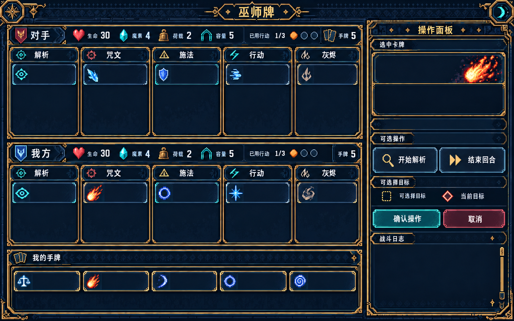
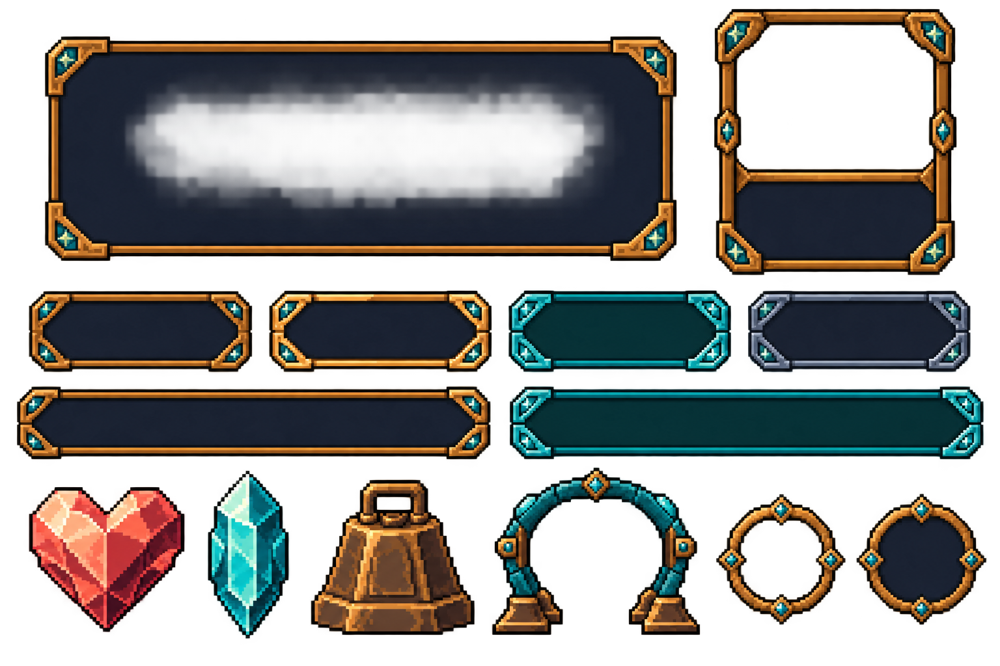
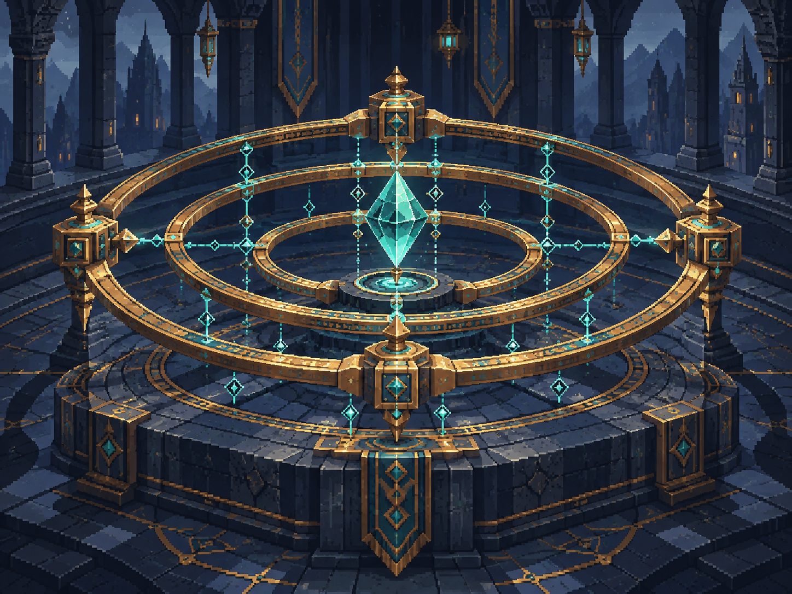
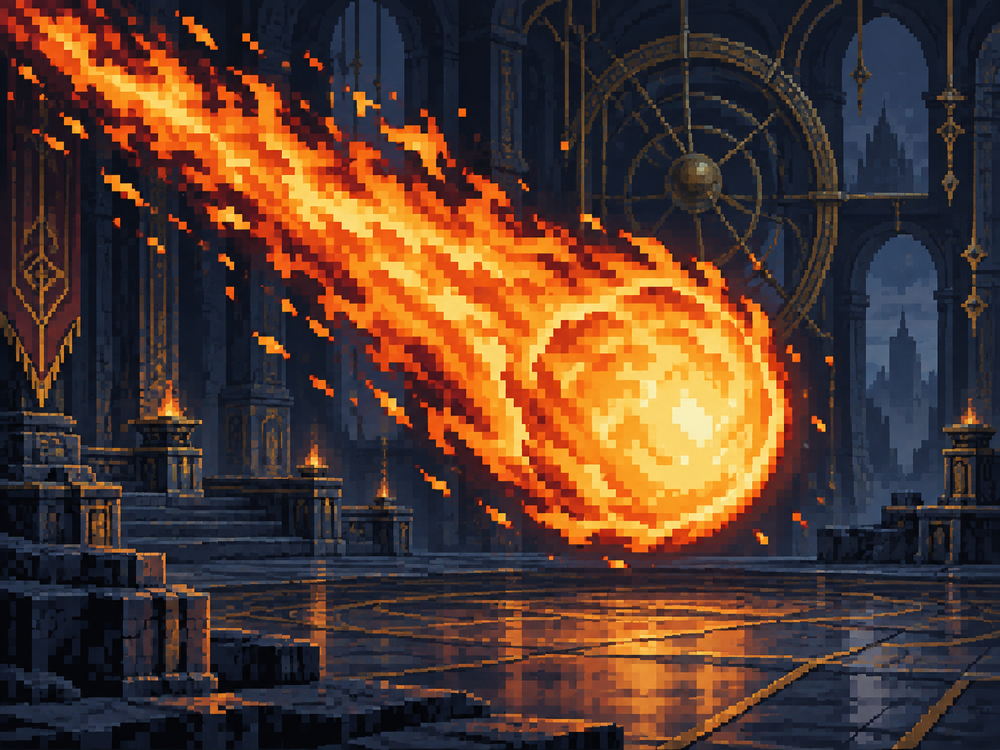
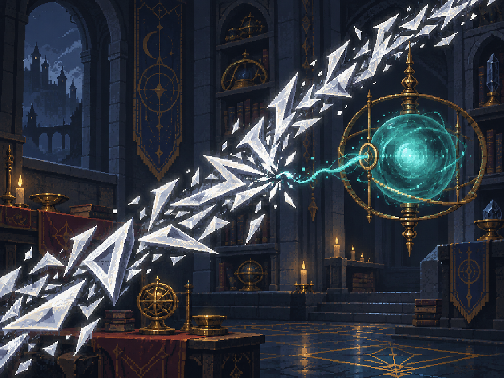
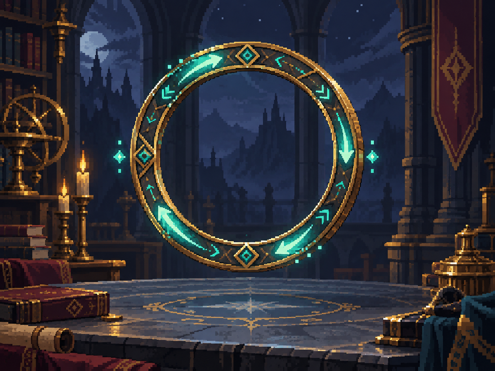

# 巫师牌：像素奇幻美术试制 v1

> 四张插画已有[无背景修订 v2](../pixel_fantasy_v2/README.md)：银光锐语简化、均衡六芒星、奥术圆环对称、火球术去背景。本页保留v1历史稿。

根据 docs 美术清单制作的首批方向样稿：**2张UI探索稿 + 4张无文字卡牌插画**。视觉采用深靛石板、古铜框饰、青绿符文和硬边像素块。

**当前为试制，未接入游戏，未通过严格限色与透明度验收。** 不是全部美术需求的完成交付。UI组件尚需清理背景及切图；其余9张插画和其他P0资源仍待制作。

- [浏览图片预览](index.html)
- [资产清单、尺寸、来源与哈希](manifest.json)
- [生成提示词（含修订）](prompts.json)
- [技术与视觉检查记录](validation.md)
- [本批范围](requirements.md)
- [设计规格](source/WizardCard_PixelFantasy_64x64_20261004/design_spec.md)
- [执行规格与色板](source/WizardCard_PixelFantasy_64x64_20261004/spec_lock.md)

所有图片由内置 OpenAI imagegen 生成，保留原始 PNG；没有另行引入外部素材。初稿放在 source 工程的 images 目录，仅供追踪；早期UI初稿含错误生成文字，已弃用。

## 对局 UI 风格稿

保留双人区域、五列公共区与横向卡条。内部卡牌与日志文字已移除；布局坐标、语义标记和中文需在真实客户端重新核对。

## 奇幻 UI 组件探索板

面板、详情框、四种按钮状态、两种卡条、四项资源符号与额度标记。整板未切分，仍有半透明背景，不能直接作为透明图集使用。

## 均衡

对称多环阵图、均匀锚点与稳定承载核心。无基础身份标记，后续由UI动态叠加。

## 火球术

大型火焰核心与明确斜向尾焰，区别于后续小型火花术。

## 银光锐语

银色锐利咒文干扰准备连接，目标法术球仍完整。取消准备语义仍需真人辨识确认。

## 奥术圆环

单枚竖立开口圆环与顺向循环能量；未画固定宿主，保持阵法和法术附着通用。

