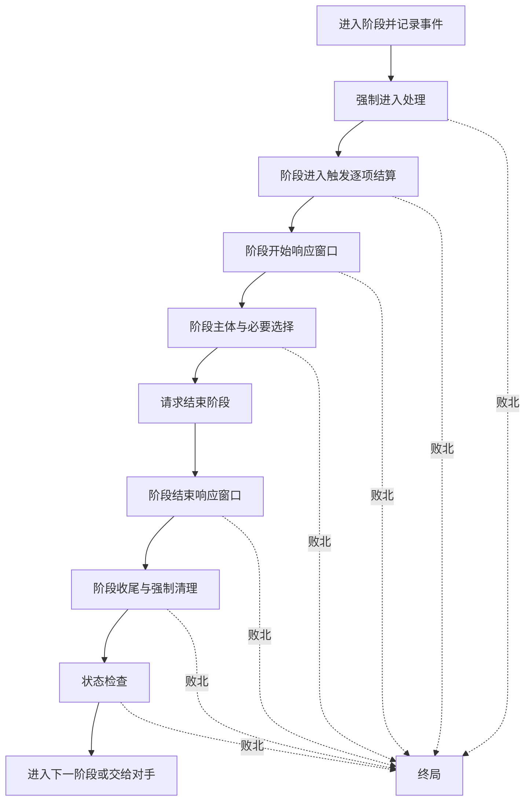
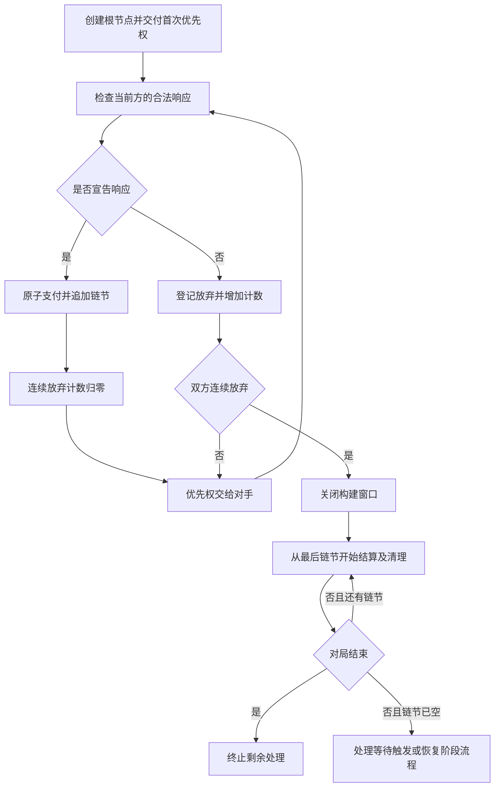

# Alpha-v1.0 五阶段与轻量连锁规则设计

设计与实施日期：2026-10-05。运行规则版本：`1.0.0`；阶段1设计基线：`0.3.0-draft.1`。

阶段2已在核心及换手客户端落实本规范。与[原型规则](design.md)冲突时，以本规范的阶段、连锁与基础阵法规定为准。[回归场景](alpha-v1.0-rule-scenarios.md)对应真实测试；实施结果及限制见[阶段二报告](reports/alpha-v1.0-stage2.md)，后续见[路线](plans/alpha-v1.0.md)。

新增11张与旧13张对齐、速度、埋伏、抗性及基础阵法编辑见[v1.0接入规范](alpha-v1-cards.md)，冲突处以该规范为准。下文保留阶段设计过程，手牌响应条款已被禁止手牌加入的新规则覆盖。

原13张卡的数值、专注持续、独立荷载和结算选择由[初版卡牌接入规范](alpha-card-updates.md)补充；冲突处以该规范为准。阶段二报告及演算数字保留当时的0.3.0测试基线。

2026-10-07 发布修订：初始及最大生命均为40；施法阶段允许选择“本阶段不再释放”，未释放的待释放法术保留在施法区，已付费用与荷载保留，后续自己的施法阶段可继续释放；言灵可单独设置，零环即时言灵另外提供“设置并释放”。细节见[发布卡池规范](alpha-release-cards.md)。

## 1. 继承规则与术语

本稿替换0.2.3的阶段推进、单层响应及固定基础阵法规则；其他费用、区域、解析、符文、持续和胜负规则继续沿用。初始生命40、恢复上限40、初始魔素1、储存上限12、基础收入1、起手5张、手牌上限8张；主牌库30张、同名最多3张。

- **回合玩家**：正在执行五阶段的一方。响应优先权改变不改变回合玩家。
- **优先权**：在当前响应窗口宣告一个合法响应或放弃响应的权利。
- **根节点**：一次待结算的行动、施法准备、实际释放、被动触发，或无效果的阶段窗口标记。
- **链节**：根节点或其上追加的响应项，包含稳定ID、发动者、来源、目标、效果快照及支付记录。
- **连锁**：一个根节点及针对当前窗口追加的所有响应。只保留一条活动连锁；结算中产生的新触发进入等待队列。
- **取消链节**：阻止指定未结算链节的效果或转换执行，保留其支付和收尾；不同于销毁来源卡。
- **取消准备**：专门取消施法准备根节点，按第6节释放本次追加荷载并保留解析进度。

荷载等于上限安全，严格超过才过载。每次宣告必须完整支付且自身荷载合法；不能借尚未结算的返还、治疗或减压支付当前宣告。取消、失效均不默认退款。

## 2. 五阶段状态机

### 2.1 公共流程

每个尚未结束的回合按抽卡→准备→主要→施法→结束执行，不跳过空阶段。先手首回合只跳过基础抽牌，仍进入抽卡阶段并处理其触发和窗口。终局立即停止，不补跑剩余阶段。

| 阶段 | 强制进入及进入触发 | 阶段主体 | 收尾 |
|---|---|---|---|
| 抽卡 | 基础抽1张，先手首回合例外；检查状态；处理抽卡阶段触发 | 仅窗口内声明的响应，无普通主要操作 | 状态检查 |
| 准备 | 先专注维持/销毁选择，再按阵法及附着符文收入获得魔素；推进解析；处理准备阶段触发 | 仅窗口内声明的响应；解析完成不自动准备 | 状态检查 |
| 主要 | 处理明确的主要阶段进入触发 | 依0.2.3进行普通主要操作，也可请求结束 | 等当前操作、连锁、触发和强制选择完成 |
| 施法 | 处理明确的施法阶段进入触发 | 回合玩家选待施放法术，逐张开启释放连锁 | 全部待施放法术处理完才允许结束 |
| 结束 | 先处理回合结束触发 | 无普通主要操作；完成开始窗口后可请求结束 | 结束窗口→到期临时荷载/修正→持续计数→超限弃牌→清除回合标记→状态检查→换回合 |

阶段进入触发完成后开放 `phase_start`，回合玩家请求结束后开放 `phase_end`。两个窗口均属于当前阶段；结束阶段的结束窗口在到期清理之前。收入、基础抽牌、解析推进、到期处理及强制弃牌本身不是可取消链节；这些规则处理完成后才检查状态或处理新触发。

进入阶段、进度推进、窗口关闭、阶段结束均产生结构化事件。不能只把主要→施法的界面按钮改名就视为完成五阶段实现。

### 2.2 停留、推进与自动通过

核心到达阶段主体后产生带稳定ID的阶段推进门。主要阶段的推进门与普通合法操作并存；施法阶段仍有待施放法术、或任意阶段有强制决策/活动连锁/待处理触发时，不能执行推进。

- `AdvancePhase` 请求结束当前阶段，不绕过结束窗口或清理。旧 `Advance` 保留为仅主要阶段可用的适配入口。
- 空阶段自动通过是客户端/AI在允许的推进门提交 `AdvancePhase`；提交记录进入复盘，核心不读取显示或音量设置。
- 默认开启空阶段自动通过；主要阶段始终显式结束。关闭该设置时，每个阶段主体都等待回合玩家确认。
- 出现响应候选、施放顺序、触发排序、弃牌或荷载选择时停留；设置、动画、失焦和换手不代替规则决策。
- 阶段推进门ID在离开该主体时失效；活动连锁期间不能使用旧门推进。已关闭的门不能用于下次同名阶段。

## 3. 响应时点与普通操作

首版支持以下六类窗口，卡牌必须明确列出可响应的窗口及附加条件。

| 窗口 | 根节点 | 首次优先权 | 根节点成功后的结果 |
|---|---|---|---|
| `phase_start` | 阶段开始标记 | 回合玩家 | 进入阶段主体 |
| `phase_end` | 阶段结束标记 | 回合玩家 | 执行阶段收尾 |
| `action` | 支付完成的行动 | 行动发动者的对手 | 执行行动效果并离场 |
| `prepare` | 支付完成的施法准备 | 准备者的对手 | 法术移入施法区并释放原环位 |
| `cast` | 选定的待施放法术 | 法术拥有者的对手 | 执行效果、奖励及瞬时/持续收尾 |
| `trigger` | 等待队列中选定的被动触发 | 触发拥有者的对手 | 执行捕获的触发效果 |

普通阵法设置/拆除/替换、开始解析、预置言灵、附加/主动拆除符文及主动放弃仍是主要阶段的原子规则操作：验证完整结果→支付→改变状态→关联清理→状态检查→处理产生的触发。它们本身不建宣告连锁。新卡如需在这些事件后触发，使用被动触发协议；不能将模糊的“随时”作为时机。

普通行动仅在自己的主要阶段发动。手牌响应是在当前窗口发动一项明确的响应能力，依其条件执行；回合玩家不能借优先权自由执行普通主要操作。解析法术的常规释放仍必须经过解析、准备和施法阶段。

## 4. 响应来源、支付及可见性

### 4.1 响应能力

卡牌通过独立响应能力声明：能力ID、可用来源区域、窗口集合、发动/目标条件、费用与额外成本、效果。缺少该声明就没有手牌响应权限。同卡的响应能力和常规使用效果分开；解析、阵法或符文卡如有手牌响应能力，也须明确声明这项独立效果。

首版响应发动条件按“窗口匹配、根节点发动者归属、目标合法”全部满足处理。归属条件为任意/自己/对手，相对响应能力拥有者判断；窗口类型和阶段上下文在整条连锁构建期间固定，不随上层响应改变。取消准备的目标策略为准备根节点；取消链节的目标策略为尚未结算的可取消链节。现有玩家/卡牌目标沿用对应核心校验，不以展示文案代替条件。更复杂的条件须先扩展有限枚举与测试，再接入卡牌。

手牌响应在本版只结算有限效果并离场，不直接建立阵法、附着符文或跳过解析使法术成为待施放。常规使用这些结构仍走各自的核心命令。所有能力只能使用实现过的条件、目标和效果枚举，内容层拒绝未知值，不提供文本解释执行或脚本。

### 4.2 来源与费用

| 来源 | 宣告处理 | 荷载与收尾 |
|---|---|---|
| 预置言灵 | 验证条件；支付能力声明的额外发动费用/成本，默认发动费用0；移出言灵区进入结算区 | 已有预置绑定荷载保留，能力规定的临时负担另计；结算或取消收尾时离场并释放绑定荷载 |
| 手牌言灵 | 必须声明允许手牌响应及手牌发动费用；一次支付该费用和额外成本，公开并进入结算区 | 实付手牌发动魔素产生等量绑定荷载；不同时支付预置费和预置模式发动费；收尾离场释放绑定荷载 |
| 其他手牌卡 | 必须声明允许手牌响应及手牌发动费用；公开并进入结算区 | 魔素费用不自动形成荷载；能力明确写出的临时负担在宣告时登记，收尾离场不提前解除负担 |

临时负担的默认到期时点为承担者当前回合的结束清理；若在对手回合产生，则为承担者下一个自己的结束清理，沿用现有临时荷载规则。卡面明确写出其他期限时按卡面。

允许手牌模式的能力必须显式给出非负手牌发动费用；预置模式的额外发动费用缺省为0。额外弃牌成本沿用当前最多一张手牌的能力范围；发动来源不能作为自己的弃牌成本，已支付的成本卡也不能再作为响应来源。需要更多成本种类或数量的新卡，先扩展支付协议及回归。

宣告前在状态副本上验证来源、时机、目标、费用、额外成本及自身荷载。无效宣告原子拒绝，魔素、手牌、荷载、优先权、链节及ID计数均不改变。UI取消选择同样不支付；只有 `submit` 接受后才形成公开链节。

每张卡牌实例在同一连锁最多宣告一次响应；宣告后离开手牌/言灵区，不能重复作为候选。本版不加入隐藏言灵、效果速度等级或响应中预置另一张牌的操作。

### 4.3 信息投影

链节声明后，其来源卡、发动者、能力、公开目标及费用公开。声明前仅拥有者能看到手牌响应候选；`GameView`不给对手候选卡名、候选数量、私有成本选择或牌库顺序。优先权和已经公开的连锁均可见。

换手客户端在操作者变化时清除未提交的界面选择并遮挡私有信息。AI只消费自己一方的投影和合法动作，不能读取完整 `GameState`、另一方手牌、洗牌种子或真实未来抽牌。

## 5. 连锁构建与逆序结算

优先权持有者可提交一个合法响应或放弃。追加响应后优先权交给对手，并将连续放弃计数置0。一次放弃只放弃当前机会；对手随后追加响应时，该玩家仍能再次响应。

双方连续放弃才开始结算，包括只有根节点的情况。某方没有合法响应时核心自动执行与手动放弃相同的规则转移并记录事件；界面不披露原因及私有候选信息。自动放弃仍计入连续放弃计数，不能直接越过另一方。

结算期间不开放新主动窗口。清除临时荷载分配、环位溢出选择等强制决策可以暂停当前链节，恢复后完成同一链节，不作为新响应。链节及根节点按后入先出的顺序完整处理；被取消的低层链节仍留在序列中，轮到它时执行其收尾。

每个链节在结算时重新验证必需目标。全部必需目标无效时，该链节失效但仍执行收尾，不改选目标、不退费、不发成功释放奖励；多目标仅处理仍合法部分。

响应及被动触发在宣告/捕获时保存效果快照，来源之后被销毁不自动取消已入链效果。只有能力明确要求来源继续存在时才重验该条件。准备和实际释放根节点属于实体转换：源法术离开所需区域后根节点失效，不能从灰烬区恢复或释放。销毁响应来源会提前清理其实体荷载，但不等于取消链节；后续收尾不得重复减荷载。

## 6. 取消、失效和卡牌生命周期

### 6.1 取消的唯一目标

增加明确的“取消链节”效果，目标为当前连锁中一个尚未结算、未取消且可取消的 `LinkId`。目标可以是根节点或较早追加的响应；不能指向正在执行/已完成的链节、另一条连锁、阶段标记或已经取消的链节。目标在宣告和结算时均检查，失效时按第5节处理。

银光锐语继续使用“取消准备”：仅响应对手的 `prepare` 窗口，指向该窗口的准备根节点。默认仍仅从预置言灵发动，不自动获得手牌权限。不同能力可针对更早链节；不引入必须紧邻上一链节的通用限制。

取消效果在结算时只标记目标，不提前移除其来源或退费。被标记链节到自己的结算位置时执行相应取消收尾；这保证荷载释放与状态检查的时点固定。第5节的全部必需目标失效，对准备/释放根节点也使用下表对应失效收尾。

### 6.2 根节点和响应收尾

| 被取消或失效项 | 收尾 |
|---|---|
| 施法准备 | 若法术仍在原阵法上，保留解析完成，移除本次施法追加荷载，标记本回合不能重试；不退魔素/额外成本。源已离场则只结束尝试，不恢复实体 |
| 实际释放 | 法术及符文离场，移除绑定荷载，无成功释放或返还奖励；准备时已支付费用不退 |
| 普通行动 | 行动离场；已登记临时负担仍按期限保留 |
| 言灵或手牌响应 | 来源尚在结算区则离场，释放其绑定荷载；已离场不重复清理，独立临时负担保留 |
| 被动触发 | 跳过该次触发效果；不因此销毁持续来源，不撤销已有其他触发 |

一次准备尝试保存自己的支付记录和追加荷载，不能直接把卡牌历史支付或所有荷载清零。多次不同回合重试独立记录。

普通法术准备成功仍只是移入施法区，尚未“成功释放”。释放根节点成功执行效果后，先处理宿主符文的成功释放奖励，再处理瞬时离场或持续状态，最后检查胜负。持续法术后续的被动触发不再次触发首次成功释放奖励。

增加独立结算区 `Resolving`：响应中的卡牌保持公开，荷载计入当前荷载，不占阵法环位、言灵槽或待施放列表。普通行动根节点仍在行动区；准备根节点的法术仍在解析区；释放根节点的法术仍在施法区。实体区域始终只有一个，链节引用不构成第二份实体。

## 7. 触发、清理、状态检查与终局

### 7.1 被动触发队列

同一事件完成后捕获触发来源、目标和效果快照，按事件形成批次。先由回合玩家排列自己的触发，再由非回合玩家排列自己的触发；同方只有一项时顺序唯一。依队列顺序逐项作为独立 `trigger` 根节点开启连锁，不能把整批倒序当作一条连锁。

当前连锁中任何链节产生的新触发追加到等待队列末尾；等本条连锁全部收尾后处理。已捕获项不因来源离场自动删除。触发排序和清理选择不开放额外响应窗口。奥术圆环的首次成功释放返还继续作为宿主释放链节的附加部分，不拆成可单独取消的被动触发。

阶段进入触发处理完才进入开始窗口；开始/结束窗口产生的触发必须在推进主体/执行收尾前排空。每个连锁使用自己的窗口上下文，不能把上一个准备事件当作后续触发窗口继续响应。

### 7.2 清理和检查粒度

状态检查发生在：每次接受的宣告与支付完成后；每个完整链节或原子操作完成直接关联清理后；每个阶段结束时。它也适用于基础抽牌等强制处理。对局尚未结束时才执行下一项。

一项效果内的多句按顺序完整执行，不在句子间判负。阵法、承载法术及附属符文必须完成全部关联离场，再计算最终容量/荷载。强制环位缩减先完成多余法术选择及清理，再检查状态；响应者不能在这些选择中额外发动卡牌。

每个链节结束均检查胜负，不等待整条连锁完成。上层链节造成生命归零、抽牌失败或过载时立即终局，下层尚未结算的治疗/减压不能补救。双方在同次检查败北则平局。抽牌失败记录不因同项效果后续恢复牌库而撤销。

### 7.3 结束清理和循环

结束窗口关闭并处理其触发后，依次：移除到期临时荷载/修正→有限持续计数减1及归零离场（专注不减计）→超限弃牌→清除回合标记→检查状态→换回合。

到期离场产生的触发先暂存，完成该轮直接清理和状态检查后再依队列处理。清理产生的触发仍可以形成 `trigger` 连锁；之后重新执行到期临时项清理和手牌上限检查，直至稳定。持续计数在同一结束阶段只减一次，阶段开始/结束窗口也只开一次；回合标记等全部工作稳定后才清除。每个清理批次内部先完成关联离场，再检查状态。

强制推进中检测重复的逻辑状态：比较玩家资源、卡牌位置/状态、荷载、阶段子步、未完成效果和逻辑触发队列，忽略事件日志、单调递增的分配ID；在同一次强制推进内确认不可停止循环后判平局。等待玩家决定的可停止循环不得自动判为强制循环，也不得接受“无限重复”命令。

终局公开结果与败北原因，清空活动连锁、优先权、决策和等待触发，不执行剩余链节或再开放阶段。保留终局时的实体与资源用于复盘；不为了清空连锁而补做尚未发生的卡牌离场。终局后的所有规则命令拒绝。

## 8. 可选基础阵法

- 卡牌定义增加 `baseEligible`，缺省为false，仅阵法可以为true。阶段2接入时显式把均衡标为true；不把现有所有阵法自动开放为基础。
- 资格校验要求阵体1～5、容量/环位/最高位阶均为正数；收入仍可为0，玩家基础收入1保持。实际候选由用户后续设计。
- 一副可对战卡组必须配置一张存在且具有资格的基础阵法。新建卡组默认均衡；未知或失去资格的已保存选择标为无效，不静默替换。
- 基础阵法在开局公开设置，正常占阵体并提供容量、收入、环位、最高位阶，不从手牌取得，不付设置费，不进入开局连锁。
- 保护绑定到基础实例：不能销毁、拆除、替换或使整体失效；本版不加入直接降低基础属性的效果。其承载法术及附属符文仍遵循各自规则。
- 主牌库可携带同名最多3张，均为普通扩展阵法，不继承基础保护；基础实例不占同名限额。
- 双方可以选择不同基础阵法。高阶牌初始无法解析可以在构筑界面提醒，但不据此拒绝本来合法的卡组，扩展阵法可提供后续能力。

## 9. 阶段2的接口与兼容性

以下接口已在阶段2实现；构筑与菜单中的配置入口继续按后续阶段接入。

| 边界 | 必须表达的内容 |
|---|---|
| `MatchConfig` / 玩家卡组配置 | 双方各自30张主牌库、基础阵法ID及种子；引擎入口与内容层共同校验 |
| `CardDefinition` | 基础资格、构筑标签、有限响应能力及发动/目标条件；现有13牌显式迁移，普通牌不自动增加响应能力 |
| `GameState` | 阶段子步、推进门、全局唯一ChainId/LinkId、构建或结算状态、优先权、连续放弃数、效果/支付快照、结束清理一次性标记 |
| `PendingDecision` | 响应决策ID与拥有者；强制决策保留各自类型；阶段推进门与主要操作可以并存 |
| 新命令 | `Respond`携带响应决策ID、来源卡/能力ID、公开目标和额外成本；`PassResponse`携带响应决策ID；`AdvancePhase`携带推进门ID |
| `GameView` | 当前阶段/子步、公开连锁、优先权、当前方合法响应与推进能力；私有候选仍按查看者过滤 |
| `MatchSession` / 复盘 | 保存双方真实主牌库和基础阵法、全部已接受命令、状态摘要；不再给双方写入同一默认卡组 |

响应窗口每交付一次优先权分配新的决策ID；换人或追加/放弃响应后旧ID失效。过期响应、错误玩家和非法目标原子拒绝，不能只在UI检查。新命令追加到现有命令编码，不重排原有类型编号；更新编码往返回归。普通核心操作、AI、点击和拖放统一经 `submit`。

规范状态摘要包含影响结算的完整阶段/连锁/队列/支付状态和ID分配计数；日志、动画、音量、手牌展示排序和空阶段自动通过设置不进入摘要。循环检测使用第7节的逻辑比较，不能直接复用包含分配计数的复盘摘要。

目标复盘格式2记录双方开局配置；程序/规则/卡池版本与内容哈希仍要求完全匹配。当前格式1的0.5复盘由原版程序读取，新版明确报不兼容，不猜测基础阵法或响应顺序。不得在阶段1把程序版本、JSON运行规则或卡池哈希提前升级。

## 10. 实现验收入口

[演算与回归场景](alpha-v1.0-rule-scenarios.md)定义准备、反制、反反制、过载的逐步数值及阶段、支付、清理、信息隔离和复盘断言。阶段2将它们转为核心与内容测试，再更新客户端选择模型及无窗口完整对局驱动。当前0.2.3的既有回归继续保留；发生规则预期变化的单层响应测试明确替换为本稿断言。

本稿不新增正式卡牌。手牌响应与取消链节能力由测试占位定义验证，之后接入用户设计的新卡；五种流派的牌表、数量与美术不是阶段1交付的完成声明。
