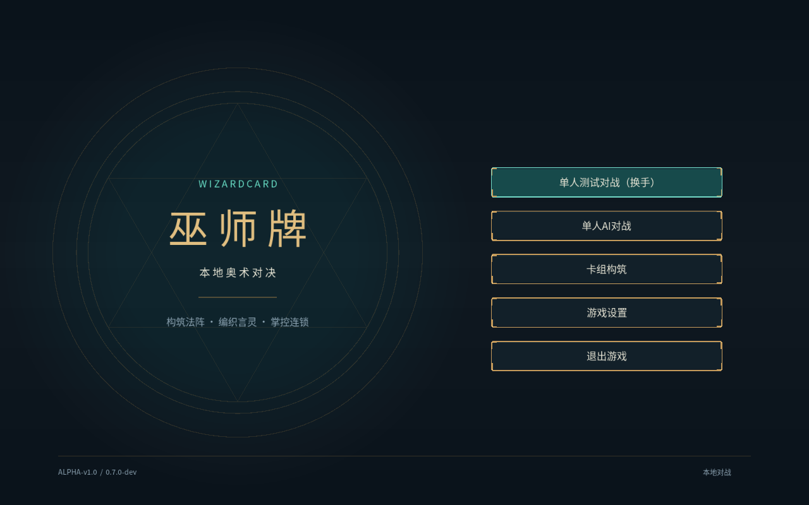
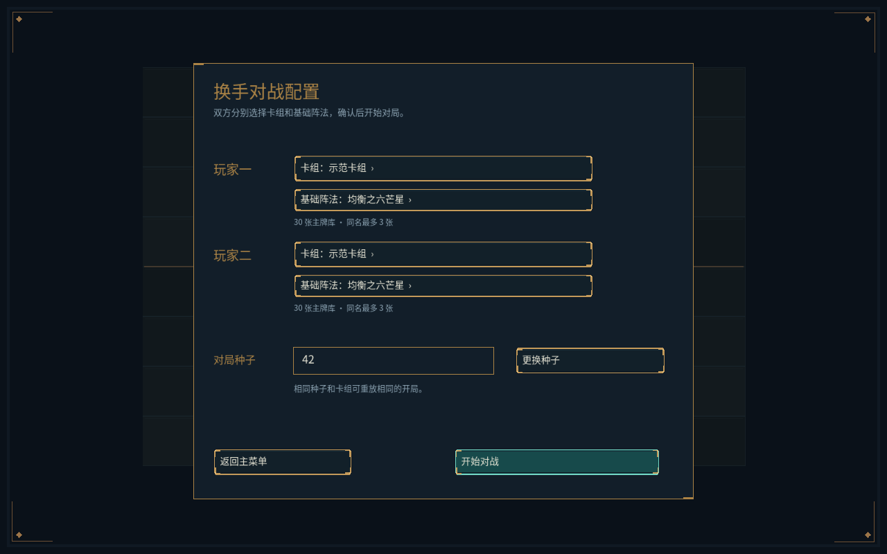
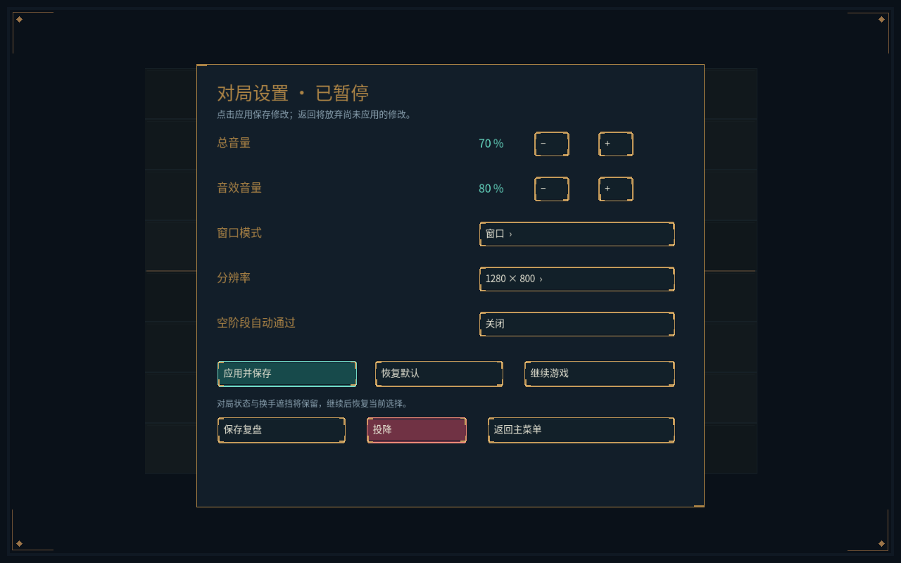

# Alpha-v1.0 阶段3：主菜单、设置与对局生命周期

日期：2026-10-05。开发程序版本 `0.7.0-dev`，规则 `0.3.1`，卡池 `0.2.0`，复盘格式2。

## 已交付

- 启动进入覆盖整个窗口的标题画面且不提前创建对局；独立法阵背景、游戏标题和右侧菜单取代场地上的中央面板。背景在16:9等比例下也铺满窗口。主菜单严格五项：单人测试对战（换手）、单人AI对战、卡组构筑、游戏设置、退出游戏。
- 换手配置分别选择双方卡组、具有基础资格的阵法与种子；开局校验双方牌表。现有“示范卡组”和“解析练习”两套30张合法预设用于验证独立开局，当前基础阵法仍只有均衡之六芒星。
- 主菜单设置与局内设置分别进入、分别返回。共用总音量、音效音量、窗口/无边框/全屏、分辨率与空阶段自动通过；主要阶段仍由玩家明确结束。应用后保存，返回放弃未应用修改。
- 局内增加继续游戏、保存复盘、投降及返回主菜单。设置和确认页面暂停命令提交，保留规则决策、界面待确认操作及换手遮挡。投降与离开均需要确认；关闭窗口采用同一保存退出流程。
- 终局可重开或返回菜单。重开保留双方实际卡组/基础阵法，生成新种子；每局独立记录。对局代号拒绝旧会话提交。
- 设置和复盘保存到用户数据目录，默认Windows为 `%LOCALAPPDATA%/WizardCard`。JSON采用临时文件和原子替换；设置损坏有提示并暂用默认，显式应用前保留原文件。离开、投降或重开保存失败时保留原对局及配置，可取消或重试。
- 总音量与音效音量的乘积接入实际声音播放，包括已有声音的音量更新。窗口模式和分辨率实际应用，逻辑1600×1000画面保持比例，其他比例补黑边。

## 接口与资源

新增无SFML依赖的 `wizard_application`，集中管理页面、设置、预设、会话和用户文件；客户端统一经Application::submit提交，设置期间拒绝命令。会话只读访问阻止绕过提交暂停。未来AI执行器需要携带当前generation；本阶段验证了暂停与过期提交协议，尚无AI执行器。

`assets/presets.json`用于发布预设；用户数据与发布资源分离。后续阶段4将在此流程中接入用户卡组、列表管理、编辑和搜索。现有卡牌插画及UI资源沿用，本阶段没有更换美术或新增音效素材。

规则与卡池版本保持。程序升级沿用当前严格复盘兼容策略：旧程序版本记录明确拒绝读取；本次使用0.7.0-dev重新生成验收记录，不提供旧记录迁移。

## 已执行验收

环境：Windows x64、MSVC 2022、CMake 3.31.6。

- Release完整构建和110/110 CTest通过；关闭客户端、无SFML的Windows Debug构建及110/110 CTest通过。新增15项应用层测试覆盖设置编码/校验、持久化、独立配置、损坏文件、保存失败、设置暂停、确认取消、投降、重开与过期动作。
- `--menu-smoke`通过实际按钮按下/松开验证主菜单、设置入口、重启读取设置、独立选牌、换手隐私、暂停、取消、投降、重开及保存返回；真实切换窗口、无边框和全屏，并恢复1280×800窗口。
- 两局完整客户端拖放重放逐条摘要一致。对每种已出现的强制决策，以及已选好但尚未确认的操作，通过实际设置/继续按钮验证暂停提交与选择恢复。

| 记录 | 接受命令 | 拖动手势 | 最终摘要 |
|---|---:|---:|---|
| 默认卡组、种子42 | 292 | 98 | `07b1e801b9ab1276` |
| 改卡决策场景、种子1 | 203 | 59 | `c0cf5846badf1866` |

种子1覆盖响应、施法顺序、可选阵法销毁、效果弃牌、效果额外准备和专注抉择。两份Release生成记录经无窗口Debug重放得到相同最终摘要。

- 主菜单、换手配置及局内设置实际截图检查通过，保留在本报告。1280×800窗口布局、窗口模式切换与16:9画面比例检查通过。
- 独立安装目录通过默认资源路径运行菜单烟测；包含预设、中文字体、卡面、UI和运行库，不依赖源码工作目录。







## 复现命令

下列用户目录仅用于验证，会写入设置和复盘；不要指向真实玩家数据。

```powershell
cmake --build build/windows --config Release
ctest --test-dir build/windows -C Release --output-on-failure
cmake --build build/headless --config Debug
ctest --test-dir build/headless -C Debug --output-on-failure
./build/windows/Release/wizard_client.exe --assets assets --user-data build/stage3-test-data --menu-smoke
./build/windows/Release/wizard_cli.exe smoke assets build/stage3-replay.json 42
./build/windows/Release/wizard_client.exe --assets assets --user-data build/stage3-test-data --drag-smoke build/stage3-replay.json
./build/headless/Debug/wizard_cli.exe replay assets build/stage3-replay.json
cmake --install build/windows --config Release --prefix build/stage3-install
./build/stage3-install/wizard_client.exe --user-data build/stage3-install-test-data --menu-smoke
```

## 后续边界

阶段3已完成；接下来实施阶段4构筑。AI页面已具备玩家/对手预设和三档难度配置、教学入口，但开始AI对局和教学按钮暂禁用；构筑入口目前展示预设卡组，未实现用户编辑。它们不计入阶段4/5完成。

正式音效素材及听感验收留在阶段6；五种方向的卡池仍需用户设计。Linux CI、真人试玩、多设备显示/音频与最终Alpha-v1.0安装包验收留在相应后续阶段。本次没有创建发行标签。
