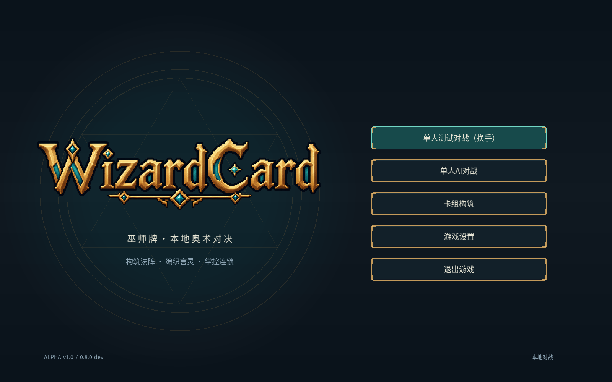
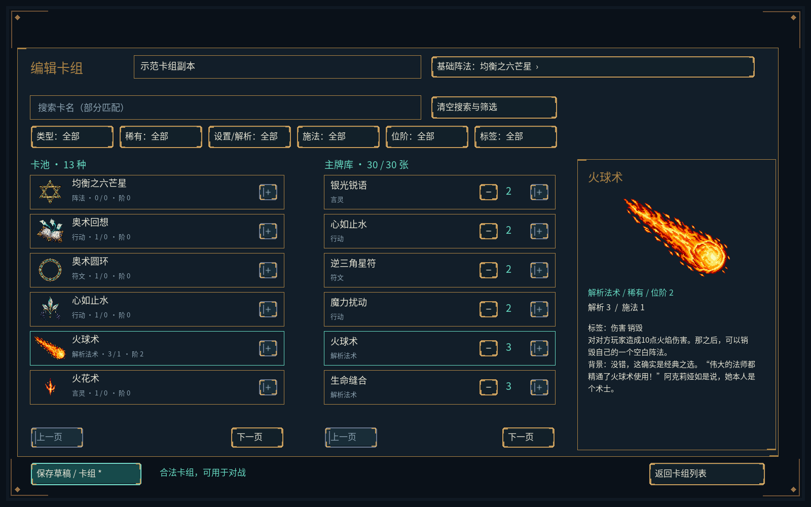

# Alpha-v1.0 阶段4：卡组构筑与标题Logo

日期：2026-10-05。程序 `0.8.0-dev`，规则 `0.3.1`，卡池 `0.2.0`，复盘格式2。阶段4完成；下一阶段为本地AI与固定教学局。

后续构筑界面已按用户参考图修订；当前界面与术语见[修订验收](deck-ui-revision.md)。以下保留0.8.0-dev交付记录。

## 已交付

- 用户指定的 `assets/art/branding/wizardcard-logo-v1.png` 已接入完整标题画面。保留透明背景、原始比例、最近邻采样和源文件像素，缺失/不可读时回退到文字标题。
- 卡组列表提供新建空白草稿、复制发布预设、点击修改、确认删除和分页。编辑器支持改名、选择具有资格的基础阵法、添加/移除卡牌、增减份数、卡池/牌表分页及只读卡牌详情。
- 搜索卡名部分匹配，组合类型、稀有度、设置/解析费用、施法费用、位阶和标签；清空搜索与筛选恢复全部。中文和英文输入经Unicode处理，支持Ctrl+A/V；详情展示现有插画、效果、背景及费用，长说明可滚动。
- 主牌库30张、同名最多3张，基础阵法不占牌库。添加操作遵守上限；已有失效或超限数据可逐张移除。底部校验入口列出全部问题并支持滚动。
- 草稿允许保存，不满足开局规则时不进入对战选项。合法自建卡组加入双方独立开局配置；开局冻结实际牌表与基础阵法，复盘记录实际展开牌表，删除或编辑用户卡组不会修改已创建对局。
- 未保存离开和关闭窗口提供“保存并离开 / 放弃修改 / 继续编辑”。保存失败保留编辑内容，删除失败保留原列表；返回菜单后可继续新建或修改。

## 数据与兼容

用户目录的 `decks.json` 使用格式1：保存稳定卡组ID、名称、基础阵法ID、卡牌ID与份数，并记录卡池版本和内容哈希。原子替换成功后才更新内存；重启加载并按当前内容重新校验。

内容升级保留失效ID、原份数和原基础阵法，显示具体问题并允许修复。损坏、不兼容或重复ID的文件保留原件并禁止覆盖；不会自动重置玩家牌表。设置、用户卡组和复盘与发布资源分开。

标签优先保留卡牌定义中的显式设计 `tags`，并补充由已实现属性/效果导出的特征标签，例如专注、伤害、回复、反制、过牌、阵法及收入。当前示例牌没有额外显式设计标签；编辑器不修改卡牌定义，不新增卡牌设计，不改变内容哈希。

本次只升级程序版本。旧程序复盘依现有严格兼容策略拒绝读取；设置格式1和卡组格式1不依赖程序版本，既有设置继续保留。

Logo SHA-256：`5766805343623cb09d4a5dc99702f02b3e1d7eaec26b3ad94cbfa36c957c8a5d`。来源及生成说明保留在[Logo记录](../../assets/art/branding/wizardcard-logo-v1.md)，本次未生成或修改图片像素。

## 已执行验收

环境：Windows x64 / MSVC 2022 / CMake 3.31.6。

- 完整Release及关闭客户端、无SFML的Windows Debug构建通过；两套均119/119 CTest通过。新增9项构筑数据层测试，64个断言覆盖存储往返、草稿、同名/数量/基础资格、组合查询、未知ID、内容升级、原子保存/删除失败、损坏文件、双方独立自建牌表及复盘。
- `--deck-smoke`经实际页面按钮按下/松开及字符输入验证：新建空白、卡池/牌表翻页、从后续页添加并移除最后一份、复制预设、中文改名、六项组合筛选、只读详情、30张与同名上限、29张草稿保存/重新加载、校验问题查看、修复成合法牌表、离开/关闭窗口确认、保存/放弃/继续、自建卡组选用开局、记录重放以及确认删除后重启验证。
- `--menu-smoke`再次通过，菜单、设置暂停、窗口模式、换手隐私、投降、重开及保存返回流程保持有效。
- 当前版本种子42完整记录292条命令；实际客户端重放经98次拖动手势逐条核对摘要，最终 `07b1e801b9ab1276`。同记录在Debug CLI重放得到相同摘要。
- 标题Logo和编辑器在1600×1000及1920×1080实际窗口截图检查通过，布局与比例正常，标题背景铺满整个窗口。
- 独立安装目录以默认资源路径通过菜单/构筑烟测及内容校验，包含Logo、字体、卡牌和UI资源、预设及运行库。数据目录使用隔离测试目录，不写入真实玩家数据。





## 复现

烟测会写入用户数据，请使用隔离目录。

```powershell
cmake --build build/windows --config Release
ctest --test-dir build/windows -C Release --output-on-failure
cmake --build build/headless --config Debug
ctest --test-dir build/headless -C Debug --output-on-failure
./build/windows/Release/wizard_client.exe --assets assets --user-data build/stage4-test-data --deck-smoke
./build/windows/Release/wizard_client.exe --assets assets --user-data build/stage4-test-data --menu-smoke
./build/windows/Release/wizard_cli.exe smoke assets build/stage4-replay.json 42
./build/windows/Release/wizard_client.exe --assets assets --user-data build/stage4-test-data --drag-smoke build/stage4-replay.json
./build/headless/Debug/wizard_cli.exe replay assets build/stage4-replay.json
cmake --install build/windows --config Release --prefix build/stage4-install
./build/stage4-install/wizard_client.exe --user-data build/stage4-install-test-data --deck-smoke
```

`--capture-page editor --screenshot <PNG>`打开预设副本供布局检查，不保存该副本。

## 后续验收

本阶段没有实现AI/教学，也没有新增卡池或正式音效。Linux CI尚未在本轮运行；跨配置验证使用本机Windows Debug。真实中文输入法、多设备显示、真人构筑/平衡试玩及最终Alpha-v1.0发行仍需后续验收，本轮不创建发行标签。
