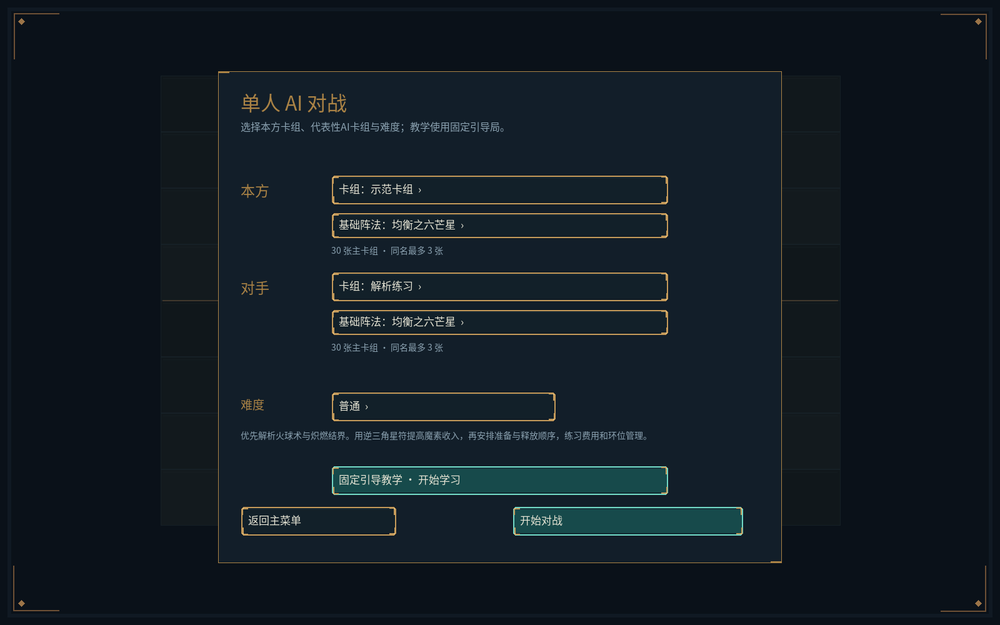
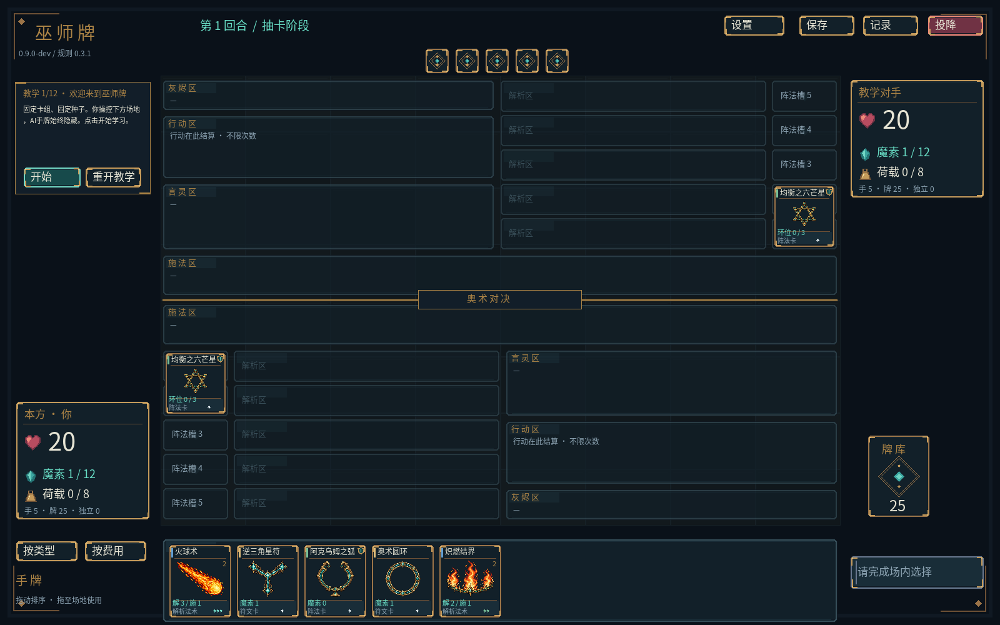
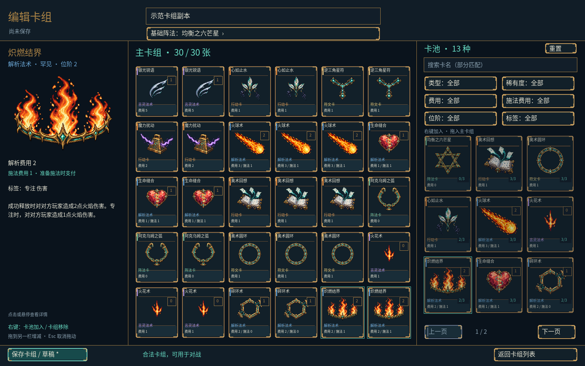

# Alpha-v1.0 阶段五：本地AI与固定教学

日期：2026-10-05。程序 `0.9.0-dev`，规则 `0.3.1`，卡池 `0.2.1`，复盘格式2。

阶段五功能与本机验收完成：五项主菜单中的“单人AI对战”开放三档难度、AI预设及固定教学入口；构筑详情与稀有度筛选中的 `uncommon` 统一显示“罕见”。本轮没有新增正式卡牌、改写卡牌效果或替换美术。

## 可玩入口

开发独立目录：`build/stage5-install/wizard_client.exe`。可直接启动，同目录包含资源、字体、许可证及运行库；用户数据继续保存于 `%LOCALAPPDATA%/WizardCard`，与资源分开。它是阶段五开发版，不是最终Alpha-v1.0发行。

主菜单 → 单人AI对战 → 选择本方合法卡组、对方预设与双方基础阵法 → 点击难度循环简单/普通/困难 → 开始对战。本方可以使用合法自建卡组；对手使用发布预设。重开保留配置及难度，生成新种子。

同一子页面的“固定引导教学 · 开始学习”独立启动固定牌表和种子39；从左侧提示操作，讲解确认使用“开始/继续”，可重开还原固定开局。教学关闭空阶段自动通过，设置暂停、保存复盘及返回菜单保持有效。



## AI决策与难度

`wizard_ai`是无窗口C++17模块，仅接收当前行动者的GameView、难度和候选预算，没有完整引擎、全卡池、随机数或对手手牌/牌库接口。双方的合法动作仍由核心投影，AI命令仍统一经Application::submit提交及记录。

| 难度 | 决策能力 |
|---|---|
| 简单 | 基础动作优先级，合法操作及安全退路 |
| 普通 | 即时伤害、资源与收益、费用和荷载、弃置卡价值及释放顺序 |
| 困难 | 普通评分上增加公开预置反制风险、低价值准备先试探、资源触发优先顺序 |

难度不更改费用、抽牌、伤害或信息权限，也不通过减少AI牌表强度实现差异。默认最多评分512个候选，上限4096；保留合法推进或放弃作为退路，拒绝已知立即导致自身过载或抽空失败的收益操作。启发式策略有限，不保证困难在所有对局中的胜率高于普通。

AI处理十种决策：响应、施法顺序、触发排序、超限弃置、临时荷载分配、手牌上限弃置、专注、效果弃牌、可选销毁自身阵法、效果给予的准备。支持手牌响应与额外弃置支付、链目标及反反制。触发评分读取GameView为当前触发排序决策提供的可见来源快照，其他查看者没有该待选队列。

单人界面始终绘制viewFor(0)，AI使用viewFor(1)；AI手牌和私有日志不交给玩家。客户端短暂显示思考提示后按帧提交，打开设置暂停并清除待提交计划。Application用generation与revision校验AI计划，拒绝旧对局、已改变状态、重复或暂停时的提交；退出、重开、保存失败遵循已有应用层生命周期。

## 当前预设

四套均为合法30张、同名最多3张，基础阵法为均衡之六芒星；AI子页面显示对应打法说明，也可在构筑器复制。

| 预设 | 练习方向 |
|---|---|
| 示范卡组 | 常见行动、解析、言灵与资源操作 |
| 解析练习 | 魔素收入、环位管理、准备及释放顺序 |
| 言灵与荷载 | 预置银光锐语、响应时机、荷载压力与上限 |
| 专注练习 | 炽燃结界持续伤害、专注费用与荷载积累 |

这四套基于当前13种示例牌，用于操作与AI决策练习；不作为阶段六“五种核心策略不同的卡组”验收。正式新卡仍由用户设计，最终各方向的AI牌表与说明随内容接入完善。

## 固定教学

教学经正常MatchConfig、洗牌、阶段与submit驱动。固定种子39使AI先手，双方各有独立牌表与所需初始卡；不注入手牌、资源、伤害或特殊规则状态。

1. 欢迎与单人私有视角，确认开始。
2. 观察对手先行动，进入本方主要阶段，认识五阶段与准备收入。
3. 设置阿克乌姆之弧，增加荷载上限。
4. 将逆三角星符附着到基础阵法，增加下回合魔素收入。
5. 费用不足先推进下一回合，再于基础阵法开始解析火球术。
6. 推进回合，等解析完成；对手通过正常预置命令布置银光锐语。
7. 准备施法，支付1魔素，开放响应窗口。
8. 对手真正响应并取消准备；观察优先权与逆序结算，支付不退款，同回合不能重试。
9. 下一回合再次准备同一张火球术，对方放弃响应。
10. 进入施法阶段释放，完成可选销毁等核心选择。
11. 确认火球术造成10伤害、进入灰烬区并清理绑定荷载。
12. 显示教学完成，随后可继续正常对局练习，AI切换简单难度。

错误操作只显示当前步骤提示，不改变核心。教学完成指学习目标完成，当前对局仍可继续；没有伪造胜负或强制结束。完整教学记录可以按普通核心复盘；讲解确认及提示不属于规则命令。



## 罕见显示修复

rarityLabel统一映射：common普通、uncommon罕见、rare稀有、epic史诗、legendary传说。卡牌详情与筛选共用映射；存储和查询仍用原内容ID，不影响卡池版本或已有卡组。



## 本轮验证

- Windows x64 / MSVC：完整Release构建，136/136 CTest通过；无SFML的Windows Debug构建同样136/136通过。最终提示调整后补跑教学与稀有度相关测试通过。
- 新增16项回归，覆盖三档策略、致命效果与自身风险、十种强制决策、有限预算、触发快照可见性、敌方隐藏信息变化不影响相同投影的AI输出、手牌响应支付弃牌与反反制、暂停与过期计划、固定教学错误操作和重开。
- 自动完整对局矩阵：三档难度 × 种子1/39/42，共9局，逐条合法提交、状态不变量及终局复盘一致；自动跑局用于稳定性验证，不计真人平衡场次。
- 独立安装目录运行`--ai-smoke`，经实际指针/卡牌菜单/拖放与确认入口走完三档完整对局及教学，验证本方固定视角、敌方私有信息遮挡、待提交AI时打开设置、恢复、重开及保存返回。
- 同目录`--menu-smoke`与`--deck-smoke`通过；换手完整拖放重放292条命令、98次手势，摘要`07b1e801b9ab1276`，沿用规则基线。
- 截图检查AI配置、教学及罕见卡详情；原指定Logo及卡牌插画未改动。

| Release记录 | 核心命令数 | 最终摘要 | 无窗口Debug重放 |
|---|---:|---|---|
| 简单AI，种子42 | 246 | `a548f6a3762e24dd` | 一致 |
| 普通AI，种子42 | 57 | `71b27e7cc1eb262c` | 一致 |
| 困难AI，种子42 | 89 | `726684f8121405ec` | 一致 |
| 固定教学，种子39 | 48 | `14b6a6d3b0745600` | 一致 |

CLI验收命令：

```powershell
./build/stage5-install/wizard_cli.exe ai-match assets build/stage5-ai-hard.json 42 2
./build/stage5-install/wizard_cli.exe tutorial-smoke assets build/stage5-tutorial.json
./build/stage5-install/wizard_client.exe --ai-smoke --user-data build/stage5-ai-test-data
```

开发执行CLI时传仓库assets；客户端默认读取独立目录同级assets。CLI教学验收51步包含3次讲解确认，规则记录为48条命令。三档AI、教学与换手记录均保存双方实际卡组及基础阵法，正常重放无需AI模块重新决策。

CI已增加Windows生成AI/教学记录、Linux下载并重放，尚未推送运行。Windows Debug验证是跨构建配置，不能记为Linux或跨操作系统通过。真人玩法、三档强度与教学体验，以及不同设备比例和音频验收仍待阶段七；免费音效、五种方向卡池及新美术批次待阶段六。本轮不发行最终Alpha-v1.0标签。

程序升级0.9.0-dev，旧程序版本复盘按现有严格兼容策略拒绝；用户设置与卡组格式1保持兼容。
