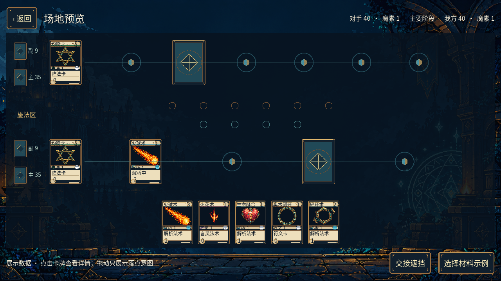
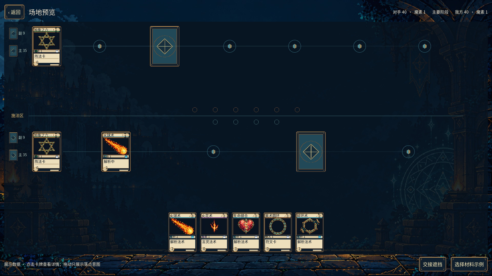
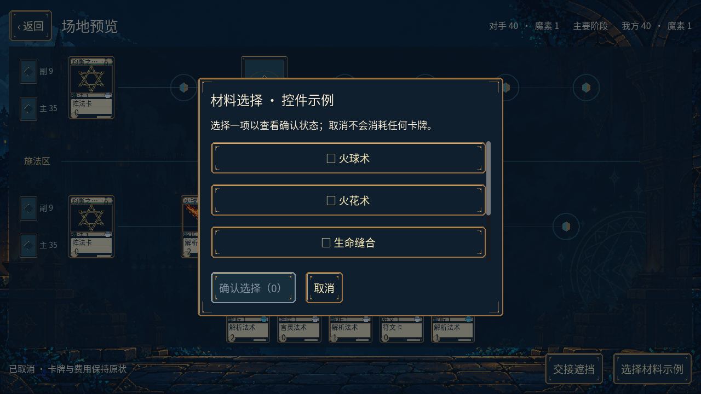
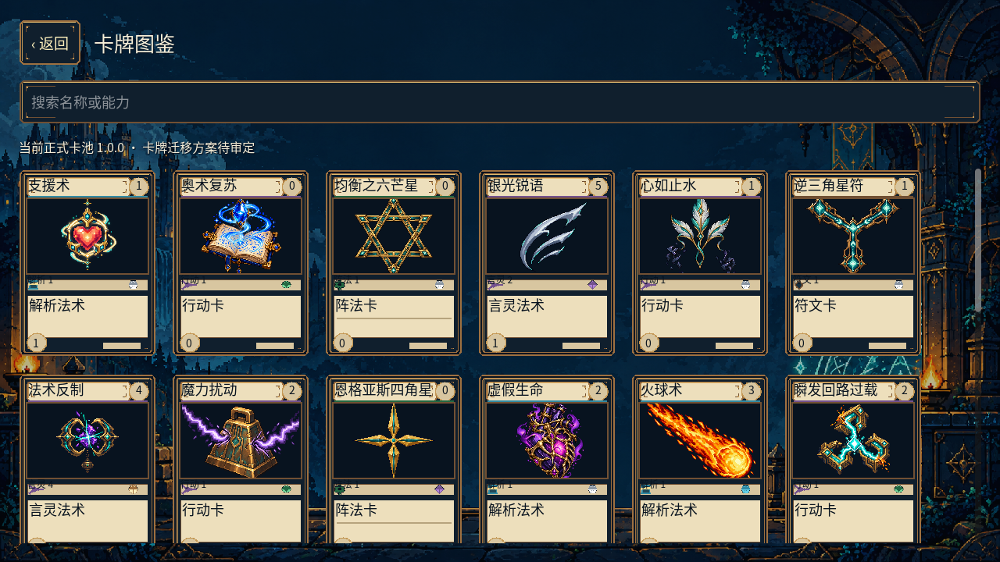

# Alpha v2.0 前端基础交付

2026-10-10，承接dev.2并行推进F01。用户确认先开发前端，并要求对战场景减少UI组件、以高质量为目标，缺失资源可由美术子代理补做。本批是可运行的Godot基础前端，不作为dev.5完整本地对局验收。

## 实现

- 主菜单、正式卡牌图鉴、设置和场地展示页分别为独立场景；类型化GDScript、共享主题、展示Resource及薄原生服务边界。
- 图鉴从实际桥接读取正式1.0.0卡池的30张卡，支持中文名称/能力搜索、完整长名称和可滚动详情。未读取待审定迁移草案，也没有将旧行动卡定义改成言灵。
- 设置通过既有原生应用层保存，保持旧存储校验和失败返回；重读验证总音量与精简动画。窗口模式/尺寸在保存成功后应用。该批不包含音频播放、动画或自动阶段推进集成。
- 场地用一个CanvasItem绘制卡牌、阵法连线、动态环位、施法槽和主/副卡组数量；没有为每张卡建立Button或为每个空位放常驻Panel。详情点击展开，材料弹窗按需出现并遮挡/锁定背景输入。
- 多阵法通过逐行浏览保持可读尺寸，不将整张1920页面缩小到720p；验证0/1/7/12环位和五阵法。尚未定义无限环位的分页和最终复杂特效布局，后续按实际规则投影补齐。
- 隐藏身份先在模型边界清除，再进入贴图、详情、提示和拖动；交接遮挡清空命中区并关闭私有详情/选择。点击/拖放只发出意图，不支付或改变展示卡牌。
- 决策控件支持单选切换、数量限制、不可用选项、取消和确认；代次/修订/决策ID使用原样字符串，旧回调被忽略。实际响应、配方和回位决策依赖dev.4会话接入。

## 美术与模块

美术子代理核对后确认无基础素材缺口，复用C资源而未新增生成。242项运行资源、全部30插画、中文字体及OFL约41.43MiB，均复制原字节，原来源未修改。`godot/art/assets.json`保留来源、SHA-256、九宫格和准确卡框区域；同步工具的`--check`仅依赖已提交资源，可在干净CI运行。

模块职责和启动方法见[Godot说明](../../godot/README.md)。运行入口为`tools/run_godot_frontend.ps1`，默认使用独立的`user://alpha-v2-frontend`开发数据，不覆盖旧客户端用户资料。

## 实测证据

- Godot4.7.2及固定godot-cpp桥接，Windows x64实际运行。
- CTest **7/7**通过（62.13秒）：原桥接边界、冷导入、CLI/Godot289条命令重放，以及真实前端导入和页面检查。记录`build/alpha-v2-frontend-ctest.log`。
- 无窗口前端检查报告**263项通过**，覆盖三种尺寸、实际Viewport鼠标/拖放/Esc输入、私有身份、交接、决策过期回调、中文筛选、长文本和设置保存/重读。报告`build/alpha-v2-godot-debug/frontend-report.json`。
- 实际OpenGL渲染检查**301项通过**，三种尺寸的四个页面及私有/决策/长文本状态均生成截图；Godot Compatibility、NVIDIA RTX4070 Laptop GPU，驱动610.74。报告`build/frontend-render-report.json`，完整图片`build/frontend-captures/`。本地复核后修正了卡名对比度、详情关闭按钮和材料弹窗背景输入。
- 本批场地数据明确标为展示，不会启动部分新规则。程序仍2.0.0-dev.2、正式规则/卡池仍1.0.0，核心定义与内容哈希未改动。上一资源规则提交bc05551的远程CI四项已全部通过。

以下为引擎实际渲染截图，非概念图：

## 后续关卡

F01控件基础可验收；F02完整玩法集成仍依赖审定卡池、新规则闭环和对应会话/决策投影。尚未交付40+10构筑、真实对局、三档AI、新版教学、联机房间、规则事件演出和独立发行包。实际IME候选、DPI、拖放手感、声音、两机与虚拟LAN仍由H01真人验收；当前截图与自动检查不替代这些关卡。1080p/60fps仍是后续性能实测目标，不以该批短时截图宣称已达到。
