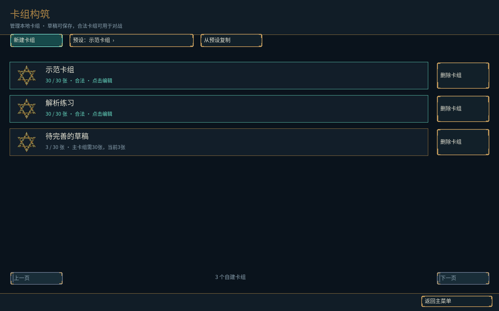
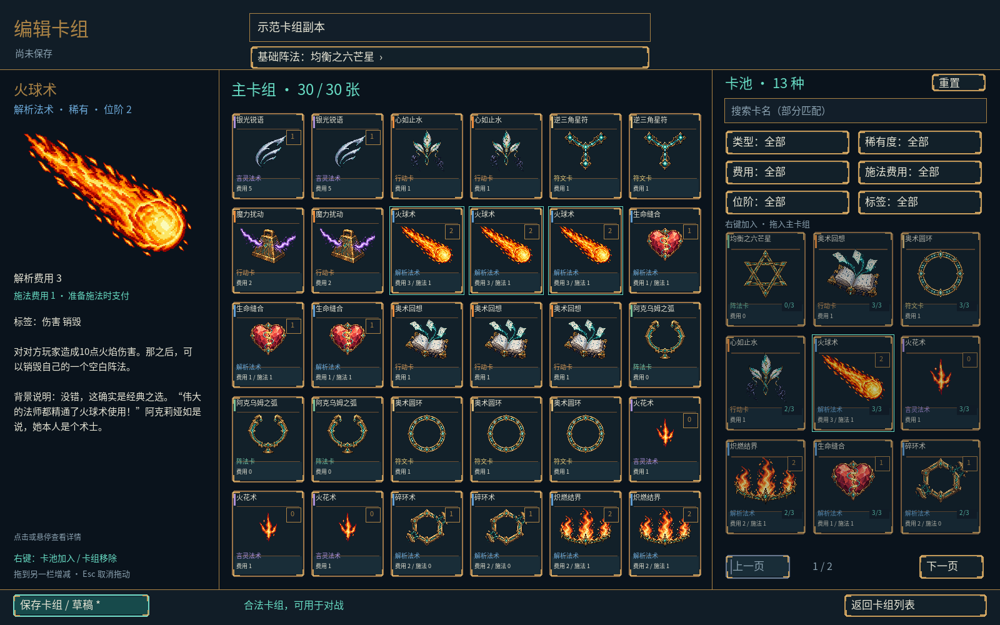
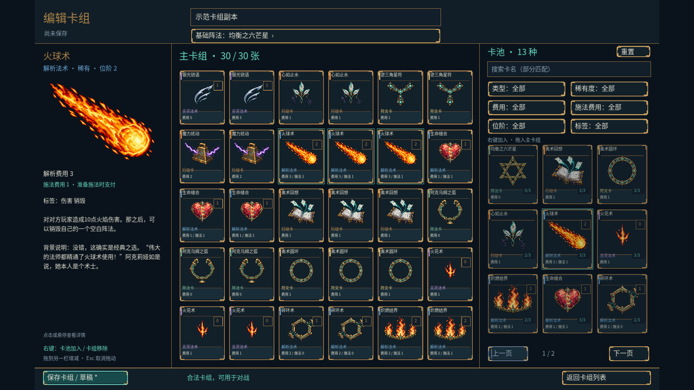

# 阶段4修订：全窗口构筑与术语

日期：2026-10-05。程序0.8.1-dev、规则0.3.1、卡池0.2.1、复盘格式2。按用户三栏参考图修订，阶段5仍为下一开发阶段。

## 界面与交互

- 卡组列表和编辑器为独立全窗口页面，背景填满整个窗口，不再在对局场地上绘制构筑面板；使用既有窗口模式设置。
- 编辑器左栏展示插画、类型、稀有度、适用费用、位阶、阵法属性、标签、效果及背景说明。长说明支持滚轮，点击或悬停卡牌切换详情。
- 中间逐张展示主卡组：6列×5行，合法30张卡同时可见，同名多份分别显示。超量历史草稿按30张分页，失效ID显示修复提示，可逐张移除。
- 右栏为卡池缩略卡牌网格，9张一页；无筛选时全部卡牌可分页浏览。支持卡名部分匹配、类型、稀有度、费用、施法费用、位阶、标签组合筛选及重置。
- 右键卡池加入一张，右键主卡组移除一张；卡池拖入主卡组加入一张，主卡组拖回卡池移除一张。拖动预览标识目标栏和加入/移除操作，不在按下或移动时改变份数。
- 无效落点、同栏拖放、Esc、右键取消、失焦或鼠标离开窗口均取消拖动。增减共用原30张及同名3张校验，不绕过保存或开局合法性检查。
- 保留新建/复制/删除、改名、基础阵法选择、草稿保存、校验详情、未保存离开确认及双方独立选用自建卡组。

## 术语与兼容

采用[卡牌与操作术语规范](../terminology.md)：统一卡牌类别；构筑称主卡组，对局区域称牌库；明确解析费用、施法费用、设置费用、使用费用和附着费用；区分开始解析、准备施法、释放法术、响应及被动触发。

位阶只用于解析/言灵法术；施法费用只用于解析法术。无对应属性的卡牌不会在“位阶0/施法费用0”查询中出现。特征标签同步采用抽牌、弃置、准备施法、魔力荷载和魔素收入等名称；显式设计标签保留。

卡面文字统一附着、弃置、手牌等用词；银光锐语明确为响应准备施法，生命缝合明确产生2点独立荷载，碎环术统一称空白阵法。卡牌名称、ID、效果参数及既有规则逻辑保持。此次卡池版本0.2.1记录文字变更，规则版本保持0.3.1。

设置和卡组存储继续采用格式1，既有用户卡组保留并重验。程序版本、卡池版本及内容哈希按现有严格策略拒绝旧版复盘，复盘格式未改动。既有美术与Logo源文件未修改。

## 验证结果

环境为Windows x64 / MSVC 2022。

- Release完整构建及Windows无SFML Debug构建通过，两套均120/120 CTest通过。新增查询回归覆盖无位阶类型及无施法费用类型的排除。
- `--deck-smoke`通过实际按下、移动、松开及右键输入路径验证双向拖动、逐张右键增减、30张展示、无效落点/Esc/右键/指针重置取消、同名上限，以及原有组合筛选、保存重启、草稿修复、离开确认、自建卡组独立开局、复盘及删除。
- `--menu-smoke`再次通过，覆盖设置、窗口模式、暂停、换手隐私、投降、重开及保存返回。
- 当前版本种子42完整对局292条命令，客户端以98次拖动手势逐条核对重放，最终摘要`07b1e801b9ab1276`；同记录在Debug CLI重放一致。
- 实际窗口截图检查1600×1000及1920×1080编辑器、1600×1000卡组列表。30张卡同时可见，三栏无重叠，宽屏边缘填充完整；截图卡组数据位于隔离测试目录。
- 更新的`build/stage4-install`使用默认资源路径通过构筑及菜单烟测，内容校验为13种定义、30张示范卡组、哈希`b7d50aee736db7fa`。Logo SHA-256仍为`5766805343623cb09d4a5dc99702f02b3e1d7eaec26b3ad94cbfa36c957c8a5d`。







## 复现

烟测会保存测试卡组、设置及复盘，使用隔离数据目录。

```powershell
cmake --build build/windows --config Release
ctest --test-dir build/windows -C Release --output-on-failure
cmake --build build/headless --config Debug
ctest --test-dir build/headless -C Debug --output-on-failure
./build/windows/Release/wizard_client.exe --assets assets --user-data build/revision-ui-data --deck-smoke
./build/windows/Release/wizard_client.exe --assets assets --user-data build/revision-ui-data --menu-smoke
./build/windows/Release/wizard_cli.exe smoke assets build/revision-replay.json 42
./build/windows/Release/wizard_client.exe --assets assets --user-data build/revision-ui-data --drag-smoke build/revision-replay.json
./build/headless/Debug/wizard_cli.exe replay assets build/revision-replay.json
cmake --install build/windows --config Release --prefix build/stage4-install
./build/stage4-install/wizard_client.exe --user-data build/revision-installed-data --deck-smoke
```

本轮不新增卡牌、美术、AI或教学。无SFML验证为本机Windows Debug，Linux CI与真实输入法/多设备试玩留待后续验收。
