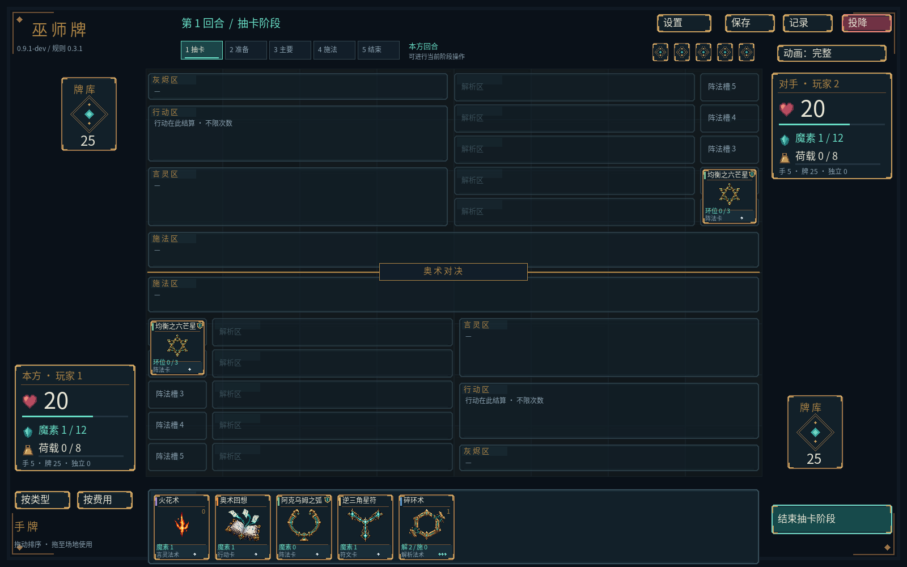
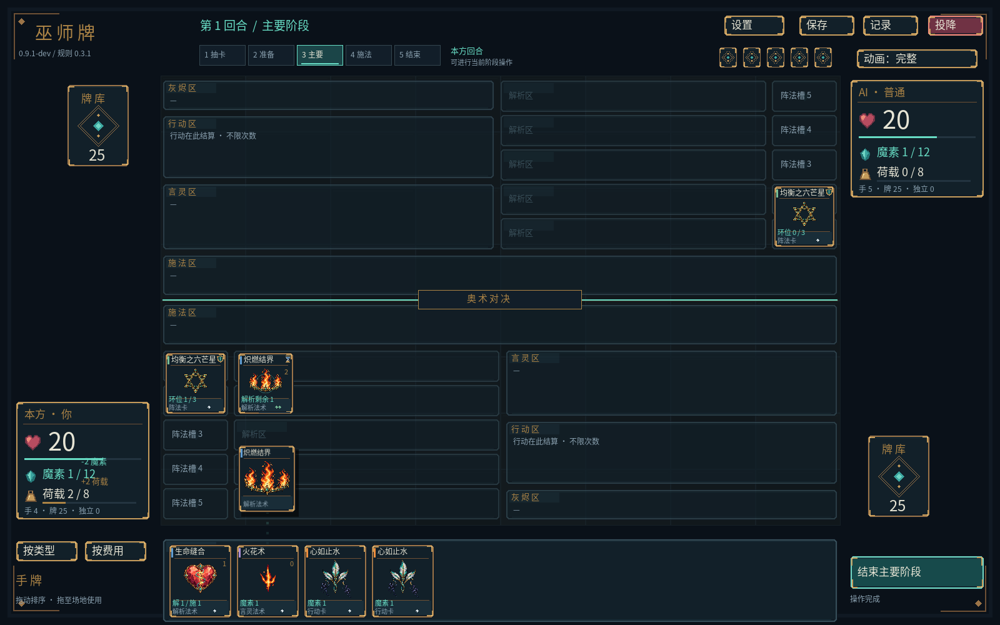
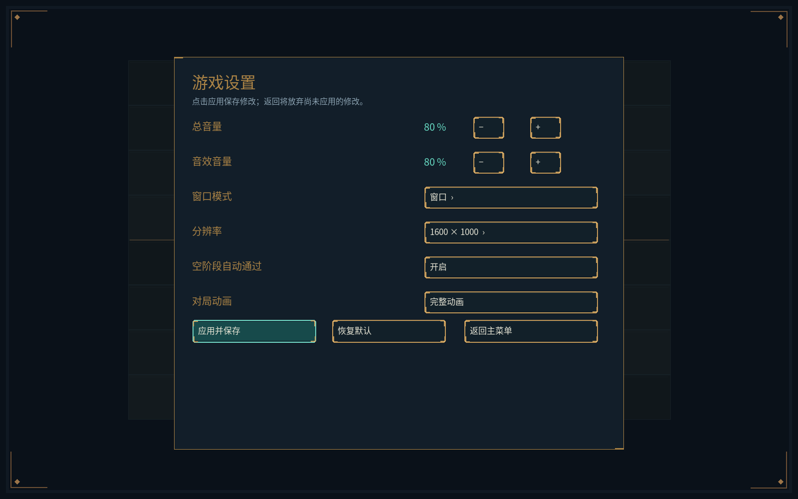
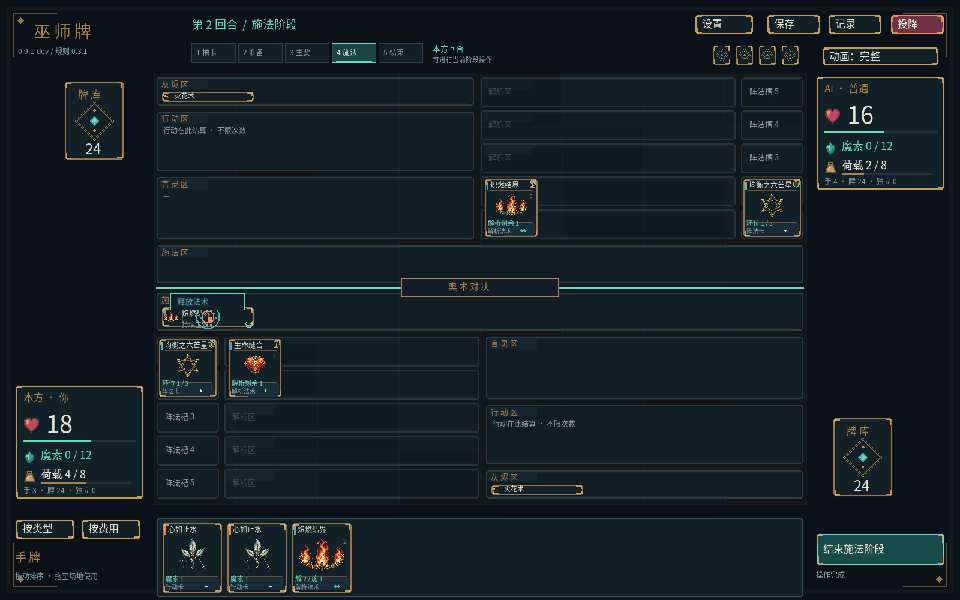
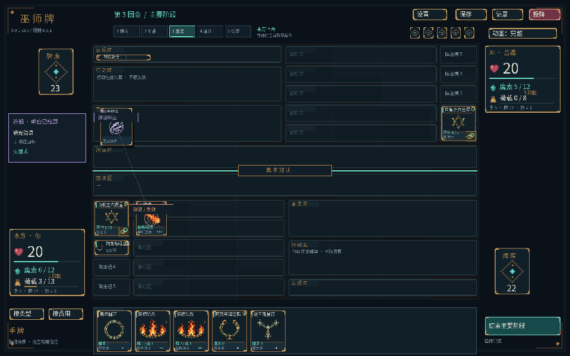

# 对局UI与动画接入

日期：2026-10-05。程序 `0.9.1-dev`，规则 `0.3.1`，卡池 `0.2.1`，复盘格式2。

已在实际对局接入进度与资源UI及动画反馈，沿用现有卡面、皮肤、字体与配色。独立运行目录为 `build/ui-motion-install/wizard_client.exe`。本轮属于阶段五之后的界面完善，五种方向卡池和资源批次仍按阶段六推进。

## 已接入的反馈

| 对局内容 | 界面与动画 |
|---|---|
| 五阶段与优先权 | 顶部进度条高亮当前阶段，显示本方/对手行动及响应优先权；阶段切换短暂提示 |
| 生命与荷载 | HUD增加生命条和荷载压力条，原数值仍保留；荷载接近上限变色不等于判负 |
| 解析 | 卡牌显示回合进度，解析完成有光环和提示；就绪卡有低强度循环边框 |
| 抽牌 | 本方卡牌从牌库进入手牌，对手只显示匿名卡背，不读取或绘制其定义 |
| 出牌、附着与离场 | 卡牌副本沿曲线移动到实际场地区域；使用后立即离场的行动经行动区呈现，单纯弃置直接进入灰烬区 |
| 准备与释放 | 准备提示、释放光环；真正造成伤害时显示弹道、冲击与生命飘字 |
| 连锁与反制 | 响应轨迹指向可见链目标，取消/失效有交叉标记；瞬间完成的响应显示短暂来源→目标摘要 |
| 魔素、荷载与回复 | 根据本次实际资源差值显示增减数值；同次结算中的数值取净变化 |

所有数值和位置依据当前规则投影。动画不生成规则效果、不改变支付、目标、胜负、随机数或复盘摘要；实时卡牌已在真实区域，移动副本只是叠加反馈，不注册点击区域。多个效果在一次submit内完成时可同时呈现，当前不逐帧重演每个内部结算步骤。





## 完整与精简模式

主菜单设置和局内设置新增“对局动画”，右上快捷按钮也能切换，成功保存后下次启动沿用。完整模式播放飞牌、光环、粒子、弹道和飘字；精简模式关闭飞牌、粒子与循环光效，状态和数值短暂显示，不漂移。

设置格式1增加可选 `reducedMotion` 布尔字段；旧文件没有该字段时默认完整模式，非法类型明确拒绝。保存失败保留原偏好与当前对局。

卡牌移动约0.55秒，状态提示约0.85秒，伤害反馈约1.05秒；精简提示约0.28秒。AI和空阶段自动通过在当前反馈到期后继续，避免连续自动操作把效果挤掉。玩家仍可查看卡牌、手动操作、打开设置；快速连续操作的存活提示限制为48个。



## 暂停、换手与私有信息

- 两份GameView必须属于同一查看者。仅复制本方手牌或已公开实例，对手抽牌只使用公开牌库张数差值，提示没有其手牌ID或卡名。
- 打开设置冻结动画时钟并暂停AI提交，恢复后继续原选择及尚未结束的反馈。
- 换手、新局、重开清除动画快照；换手遮挡期间不绘制飞牌、飘字、详情、私有日志。涉及查看者变化的操作不会续播旧动画。
- 操作菜单、决策、日志、教学和结果面板绘制在效果上方，原按钮与目标命中区域保持；动画副本不能被当成新的规则对象。

## 原生动画帧预览

以下预览由客户端对同一次真实规则提交采样20帧后编码，逻辑画布1600×1000，GIF缩至960×600便于查看；不是新美术资源或规则模拟。PNG保留原窗口尺寸。





代码位于 `include/wizard/presentation.hpp`、`src/client/presentation.cpp` 与 `src/client/match_effects.inc`。纯C++呈现模型不依赖SFML，渲染层使用现有纹理、几何线条与粒子；本轮没有新生成或替换卡面、Logo或音效。

## 本轮验收

- Windows Release完整构建，143/143 CTest通过；关闭客户端的无SFML Windows Debug完整构建，同样143/143通过。最终瞬时链目标完善后，两种配置的呈现专项8项通过，包含现有手牌呈现隔离测试。
- 新增7项回归覆盖敌方隐藏手牌/牌库和私有事件、匿名抽牌、使用与弃置区分、解析完成/准备/响应/取消/单次提交内完整释放、真实资源差值、换手清理、有限队列与确定性时钟、精简模式和旧设置兼容。
- 实际客户端`--ai-smoke`走完三档完整对局及固定教学，检查动画快照无敌方私有卡、局内开关保存且不改变核心状态、设置暂停及复盘一致。
- `--menu-smoke`通过，覆盖两种设置页面流程、动画偏好保存与重读、窗口/无边框切换；`--deck-smoke`保持构筑流程可用。
- 换手`--drag-smoke`完整重放292条命令、98次手势，逐条摘要一致，最终`07b1e801b9ab1276`；暂停验收额外断言动画年龄和数量不变。
- 单人固定视角重放57条AI命令与48条教学命令，检查释放、出牌、响应及取消的原生窗口截图；其中人类命令走实际控件，录制的AI命令经应用层直接重放。
- 普通AI记录在无窗口Debug重放得到`71b27e7cc1eb262c`，教学记录得到`14b6a6d3b0745600`，与Release一致。
- 独立目录含客户端、CLI、同级assets、字体、许可证及运行库；使用隔离用户数据验证菜单、AI与教学。文档和代码空白、格式检查通过。

Windows Debug是跨配置验证，不能作为Linux或远程CI结果；本轮没有执行远程CI。真人动画节奏、不同设备与窗口比例体验仍需试玩，不以截图和自动交互代替。程序升级后旧程序版本复盘按现有严格兼容策略拒绝，设置和卡组格式继续兼容。

## 复现

在仓库目录运行，测试使用独立用户数据：

```powershell
./build/ui-motion-install/wizard_cli.exe ai-match assets build/motion-ai.json 42 1
./build/ui-motion-install/wizard_cli.exe tutorial-smoke assets build/motion-tutorial.json
./build/ui-motion-install/wizard_client.exe --assets assets --user-data build/motion-preview-data --ui-smoke build/motion-ai.json --capture-page ai-replay --showcase --capture-step 20 --animation-time 0.52 --animation-frames build/motion-release-frames --screenshot build/motion-release.png
./build/ui-motion-install/wizard_client.exe --assets assets --user-data build/motion-preview-data --ui-smoke build/motion-tutorial.json --capture-page ai-replay --showcase --capture-step 34 --animation-time 0.22 --screenshot build/motion-response.png
```

动画采样和导出需要`--screenshot`入口；捕获不会提交额外规则命令。普通游玩直接启动独立目录客户端即可，默认读取同级资源。
